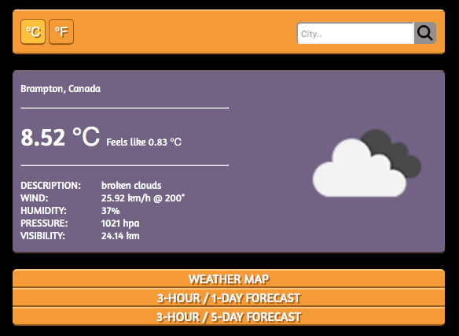
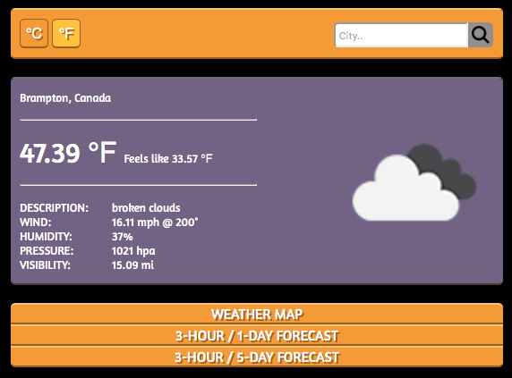
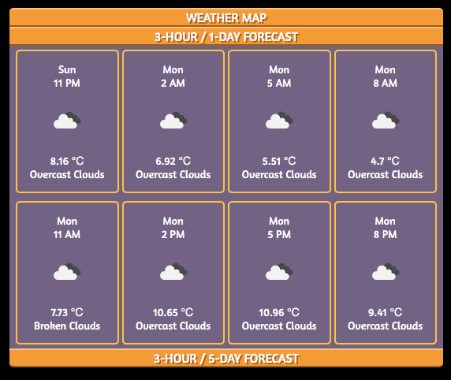
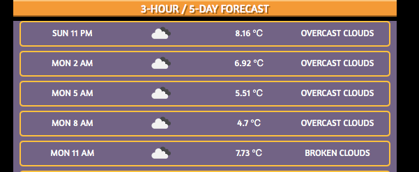
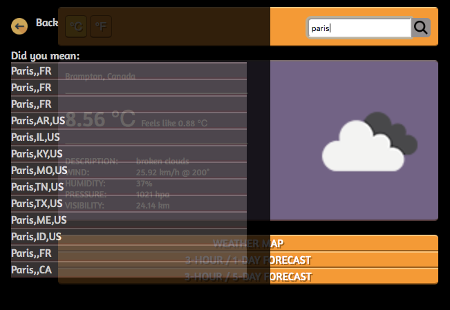

# WeatherApp
Developing a web app that displays weather for a given city, using openweathermap API.

## Usage
Download the project and ensure the following are present:
- /js 
- /css
- index.html

You must add your own openweathermap api key.
- Create a *config.js* under the *js* directory. Add your key to constant *WM_KEY* OR
- Replace *config.WM_KEY* in */js/script.js* with your key

Navigate to project path in terminal and use 'http-server' or 'live-server' to run locally.

## Features
This app is designed mirroring some features already available on the web. The design inspiration comes from _theweathernetwork.com_. All processing is done in the front end, which causes application to run a little resource heavy.

The following can be observed:
* Current weather:
  * Temperature, description, wind, humidity, pressure and visibility data
  * Current weather condition icon
* 3 hour / 1 day forecast:
  * Eight blocks of three hour segments weather data
  * Each block contains time, day, weather icon, weather description and temperature
* 3 hour / 5 day forecast:
  * A list of 40, three hour segments weather data
  * Each item contains time, dat, weather icon, weather description and temperature
* Choice of metric or imperial units
* Search for any city
* Weather map (currently unavailable)

## Objective
1. Display ability to use HTML, CSS, Javascript and jQuery effectively
2. Understand AJAX calls and API usage (w/JSON and XML)
3. Using Mockfow for webpage design
4. Completing this project that I struggled with in University

## Design Document
### Templates
As per my requirements, the UI was designed on Mockflow. The following is the template that is actualized in my product:  

### Final App
Metric and imperial units selection:  
  

3 hour / 1 day forecast:  
  

3 hour / 5 day forecast:  
  

Search for any city:  
  

## Final Thoughts
At this point, I have successfully created a functional weather app. My journey has lead me to understand AJAX calls with an API. JQuery allows to minimize and simplify the vanilla JS code. A simple HTML template can be vastly manipulated by CSS and JS to present data and messages beautifully. HTML and CSS used to intimidate me, lots of elements(ie., divs :( ) and selectors. But through this project and my training over the past month has made me more confident. By planning out my vision for the app on Mockflow I was able to actualize the template in less time. Overall, the objectives I had set for myself with this project have all been met.  

*FUTURE*  
It is now time to implement Back-end to such projects and play with a more full stack environment. I would like to engage in a new front-end framework, like AngularJS. 