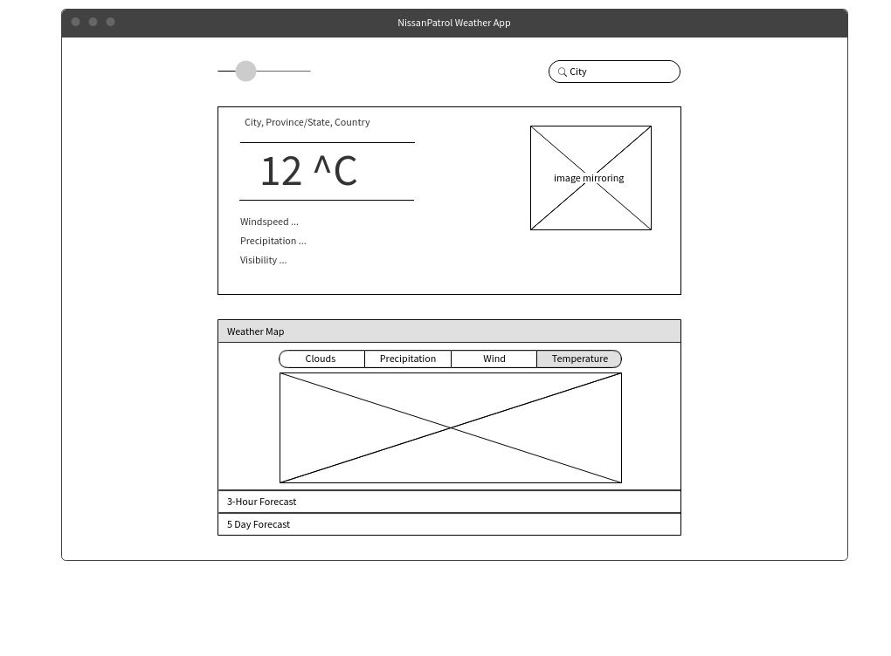
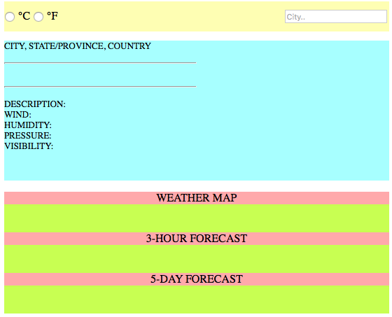

# WeatherApp
Developing a web app that displays weather for a given city, using openweathermap API.

## Objective
1. Display ability to use HTML, CSS, Javascript and jQuery effectively
2. Understand AJAX calls and API usage
  * JSON and XML usage
3. Using Mockfow for webpage design
4. Completing this project that I struggled with in University

## Features
This app is designed mirroring some features already available on the web. The design inspiration comes from _theweathernetwork.com_. 

The following can be observed:
* Current weather:
  * Temperature, description, wind, humidity, pressure and visibility data
  * Current weather condition icon
* 3 hour / 1 day forecast:
  * Eight blocks of three hour segments weather data
  * Each block contains time, day, weather icon, weather description and temperature
* 3 hour / 5 day forecast:
  * A list of 40, three hour segments weather data
  * Each item contains time, dat, weather icon, weather description and temperature
* Choice of metric or imperial units
* Weather map (currently unavailable)

## Design Document
As per my requirements, the UI was designed on Mockflow. The following is the template that is actualized in my product:

Initial HTML template based on the Mockflow design:

